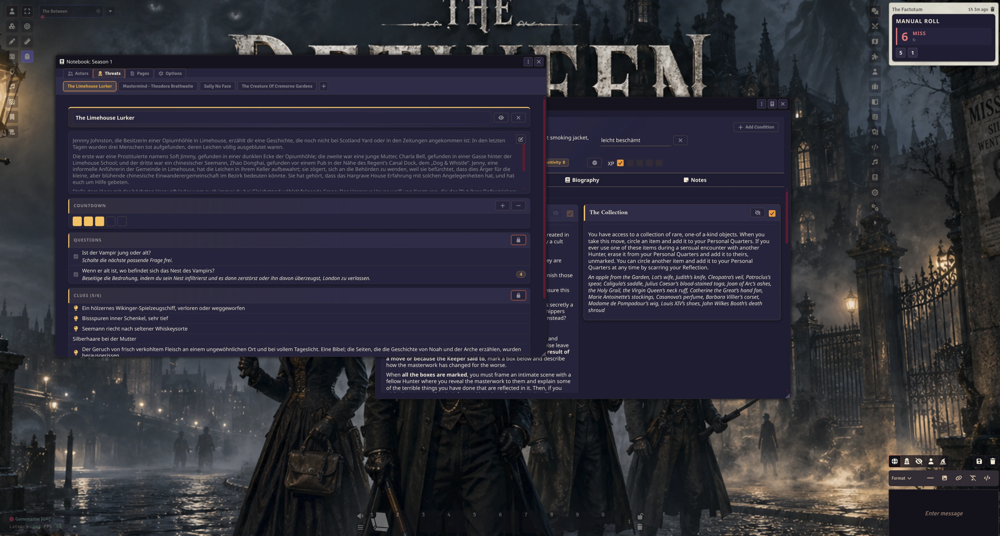

# Mystery Engine for Carved From Brindlewood Bay games

 

This is a **unofficial** system implementation for Carved From Brindlewood Bay games.

Check out [The Gauntlet](https://www.gauntlet-rpg.com/) for their great TTRPG games!

This system works different than a normal FoundryVTT system for a specific
TTRPG system. Instead having a ready made character sheet where you simply
enter your attributes etc, you build a character sheet in this system.

It's easy and nearly the same amount of work in another system. You build a 
Public Access or The Between sheet in minutes.

The notebook app is for handling a session or campaign. You see an overview
of the characters, the threats and notes/page handling. Your players
can use the notebook too, but they are not able to alter it and they see
only stuff they should see like clues for threats etc.

## Features
 - Notebook for the GM to handle a campaign / session
 - Character & Threats sheets
  

## PreBuild Character Sheets

We got the permission from The Gauntlet to publish pre-build character sheets with the system. The system ships with no threats / mysteries etc, only the character options are available as compendium entries.

Available pre-built sheets:

- Public Access
- Brindlewood Bay
- The Between
  
## Supported games are

- The Between
- Public Access
- Brindlewood Bay
- any other game of the type of Brindlewood Bay

## Text styling of checklists

The checklist item supports bbCode styling

* [b] bold[/b]
 * [i] italic[/i]
 * [u] underline[/u]
 * [s] strikethough[/s]
 * [br] line break[/br]
 * [list] list item 1 [br] list item 2 [br] list item 3 [/list]
 * [ON 10+] roll outcome badge

### Roll outcomes

`[ON …]` marks a roll outcome and renders it as a coloured badge. It works in checklist entries
as well as in the description and move description of a move, where each tagged line becomes a
badge row.

    [ON 12+] you also find a Clue; the Keeper will describe it.
    [ON 10+] the magic works without further cost: choose your effect.
    [ON 7-9] the magic works imperfectly: choose your effect and a complication.
    [ON 6-]  the Keeper reacts.
    [ON hit] you find a Clue. The Keeper will tell you what it is.
    [ON miss] you glimpse a terrible fate awaiting one of your fellow Hunters.

Number ranges are shown as written, `hit` and `miss` are localised via `ME.Roll.HitShort` and
`ME.Roll.MissShort` — so a translation only has to translate the surrounding text, never the tag
itself. Any other token still gets a badge, just without a colour.

For backwards compatibility the English wording `On a 10+, …` is recognised as well, but new and
translated content should use the tag.
  
## Manifest-URL for manual installation of the system

    https://github.com/MrTheBino/mystery-engine-fvtt/releases/latest/download/system.json

## Developer Commands

    npm run build # generates CSS from the sass files
    npm run unpack-compendium # generate json files from the compendiums
    npm run pack-compendium # generates compendiums fron the json files

## Foundry VTT Preview Screenshot
